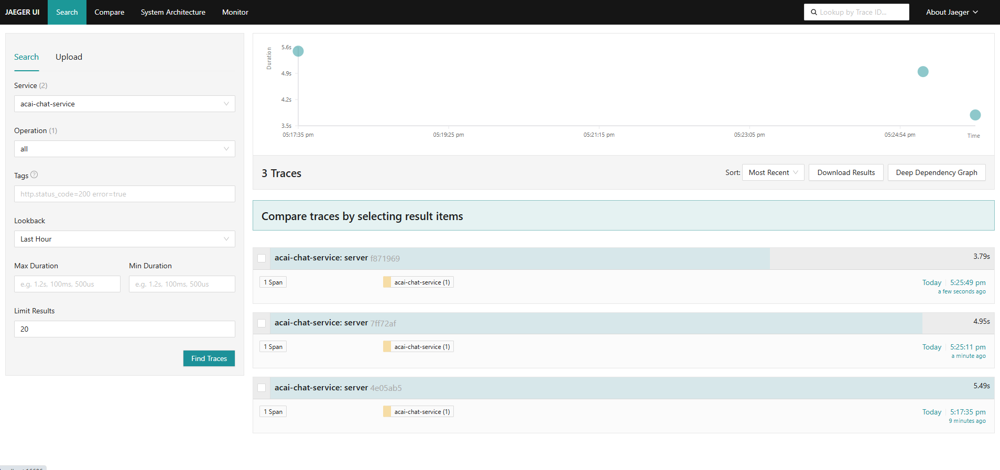
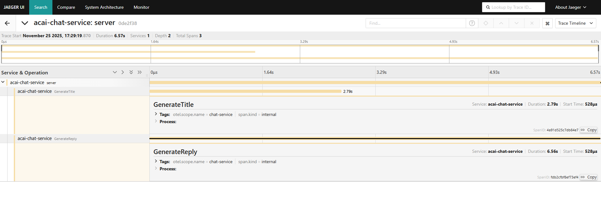
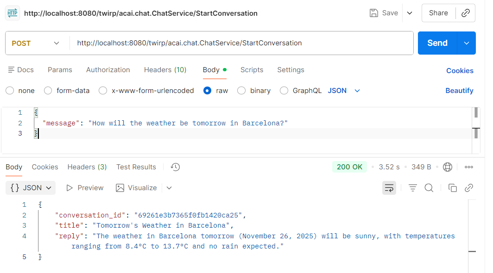
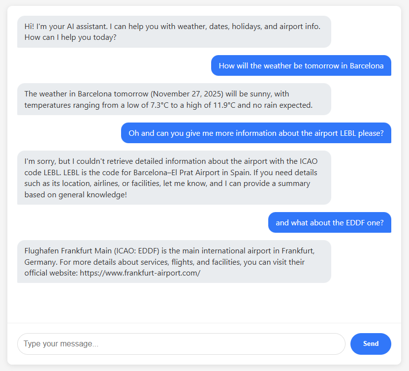
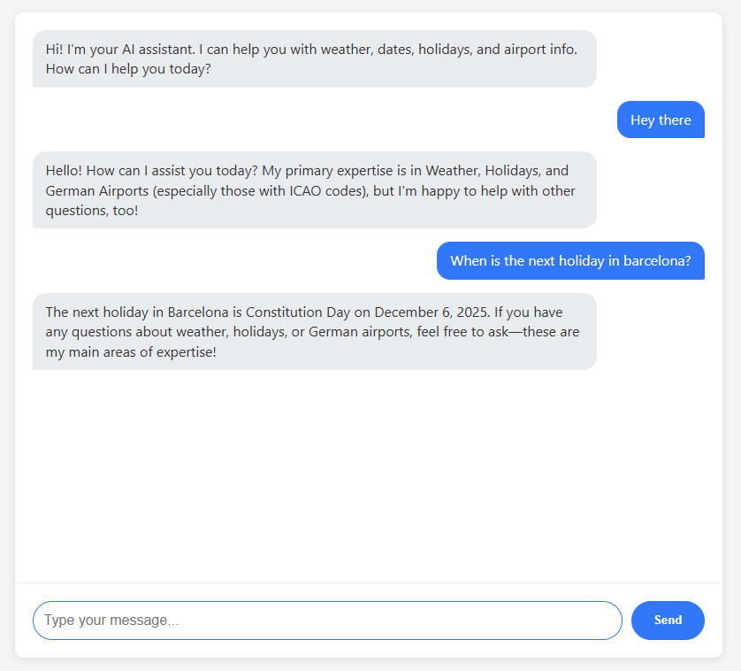
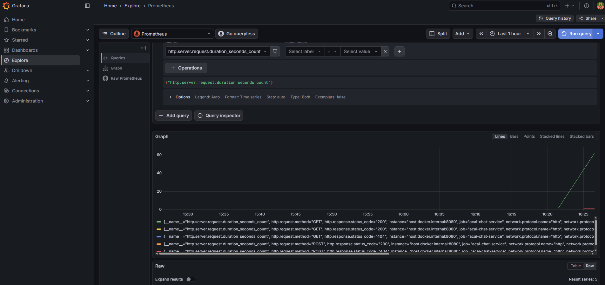

# AC Challenge Solution

## How to Run

1.  **Start Infrastructure**:
    ```bash
    make up
    ```
    This spins up MongoDB, Jaeger (for tracing), Prometheus (metrics), and Grafana (dashboards).

2.  **Environment Variables**:
    Make sure you have these exported in your shell:
    ```bash
    export OPENAI_API_KEY="sk-..."
    export WEATHER_API_KEY="your_key_here" # Check the email I sent for this one!
    ```

3.  **Run the Server**:
    ```bash
    make run
    ```
    The server will start on port 8080.

4.  **Run Tests**:
    ```bash
    make test
    ```
    This runs all unit and integration tests. Integration tests will skip if API keys are not set.

## What I Did

### Task 1: Fix Title Generation
The title wasn't being saved because the system instruction was being overwritten incorrectly. I fixed that logic, and also made the title and reply generation run in parallel. Now the response is snappier.

### Task 2: Weather API
I integrated **WeatherAPI.com** to get real weather data.
- Supports current weather.
- Supports forecasts (up to 14 days).
- You can ask for "weather in Barcelona next Monday" or "hourly forecast for tomorrow".

### Task 3: Refactor Tools
The tool logic in `assistant.go` was getting messy, so I refactored it out.
- Created a `internal/chat/tools` package.
- Implemented a **Registry** pattern to manage tools easily.
- **Bonus**: Added a `get_time_in_zone` tool. You can ask "What time is it in Tokyo?" and it works.

### Task 4: Automated Tests
I added a mix of unit and integration tests:
- **Server Tests**: Uses a `MockAssistant` to test the API endpoints without hitting OpenAI (fast & free).
- **Assistant Tests (Bonus)**: Added an integration test that actually hits OpenAI to verify the prompts work. It skips automatically if you don't have the API key set.
- **Tool Tests (Bonus)**: Added unit tests for `DateTool`, `TimeInZoneTool`, `WeatherTool`, and `ForecastTool` to ensure proper error handling and validation.

### Task 5: Instrumentation (Observability)
I instrumented the server with **OpenTelemetry**.
- **Metrics**: Basic metrics (request count, duration) are printed to stdout (kept it simple as requested).
- **Tracing (Bonus)**: I added **Jaeger** to the docker-compose.
    - Go to `http://localhost:16686` to see the traces.
    - I added manual spans so you can see exactly how long "GenerateTitle" vs "GenerateReply" takes in the waterfall view.





I later found out that you can limit which fields the weather API returns. This would be good practice to exclude data I don't need. It would help the AI focus on common things like rain or sun instead of all the irrelevant details. I'm still keeping everything for now just in case, but ideally I should limit what information comes back from the API.

## 11/26 improvements.

### 1. Folder Reorganization & Architecture Improvements
- **Cleaner Structure**: Reorganized the codebase into a more maintainable architecture with better separation of concerns.

### 2. New Tool: Airport Information
- **`get_airport_info`**: Added a new tool to retrieve German airport information by ICAO code (e.g., EDDF for Frankfurt).

### 3. Conversation TTL (Time-To-Live)
- **Automatic Cleanup**: Implemented MongoDB TTL indexes to automatically delete conversations after 5 minutes of inactivity.

### 4. Simple UI POC




- **User-Friendly Interface**: Basic static HTML/JavaScript chat interface.
- **Direct Integration**: The UI connects directly to the Twirp API endpoints.
- **Session Persistence**: Properly maintains conversation context using `conversation_id`.
- **Accessible**: Visit `http://localhost:8080` to interact with the chatbot through a browser.

### 5. Enhanced Observability Stack (Personal Touch)



While Task 5 originally asked for a simple metrics system, I decided to go significantly beyond that because I'm genuinely passionate about observability and systems analysis. Understanding how systems behave internally, identifying bottlenecks, and visualizing data flows is something I deeply enjoy, so I implemented a complete, production-grade observability stack:

#### What I Added:
- **Prometheus**: Full metrics collection with custom instrumentation
  - Scrapes `/metrics` endpoint every 5 seconds
  - Tracks request counts, latencies, and custom business metrics
  - Access at `http://localhost:9090`

- **Grafana**: Dashboards for visualization
  - Pre-configured data sources for Prometheus and Jaeger
  - Explore metrics and traces in a unified interface
  - Access at `http://localhost:3000` (user:admin, password:admin)
  - To access an specific log go to explore and select the log name.

- **Jaeger + OpenTelemetry Tracing**: Distributed tracing with detailed spans
  - Instrumented the Assistant with proper tracing (Reply, Title, Tool execution)
  - Visual waterfall showing exact timing: OpenAI calls vs. tool execution
  - Rich attributes on each span (tool names, arguments, errors)
  - See the detailed trace flow at `http://localhost:16686`

#### Why This Matters to Me:
This isn’t just about checking a box—it’s something I genuinely enjoy. I like having clear visibility into what the application is doing, understanding how it behaves under different conditions, and having the data to improve it. Working with systems in this way is something I find personally rewarding.

---
Let me know if you have any questions!

## Potential Improvements

If I had more time, here are some enhancements I'd consider:

- **Response Streaming**: Implement SSE/WebSockets to stream AI responses in real-time for better UX
- **Rate Limiting**: Add per-user/IP rate limits to prevent API abuse
- **Weather API Caching**: Cache weather responses (10-15min TTL) to reduce API calls and improve latency
- **Retry Logic**: Implement exponential backoff for OpenAI and Weather API calls to handle transient failures
- **Custom Metrics**: Track business metrics like tool usage frequency and conversation length in Prometheus
- **Conversation Search**: Add full-text search across conversation history using MongoDB Atlas Search
- **Alerting**: Set up alerts for error rates, latency spikes, and API quota limits
- **Load Tests**: Add performance validation tests to ensure the system handles high request volumes
- **E2E Tests**: Create end-to-end tests simulating real conversations with deterministic OpenAI mocks